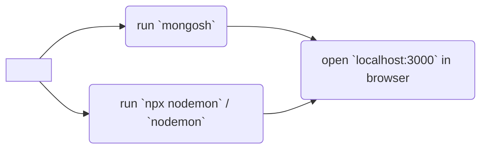

# YelpCamp

###### 
Capstone project in Colt Steele's [Web Developer Bootcamp](https://www.udemy.com/course/the-web-developer-bootcamp/) course on Udemy

###### 
- [Colt Steele's repository](https://github.com/Colt/YelpCamp)

## Description

Campground finder app

(**description to be edited**)

---

note when working on another PC , will need to do another .env file
for cloudinary info
https://www.udemy.com/course/the-web-developer-bootcamp/learn/lecture/22346302#questions
THIS IS NEEDED FOR IMAGE UPLOAD

## Usage

If it is your **first time** running app on device, please:

- run `node seeds/index.js` to seed database (no need to do it ever again)
- run `npm i` to install dependencies

## BUG FIX

If you ever reseed or are installing this on a new device, once you have started up Yelp-Camp on your localhost server, you will have to **register a new user** or else you will get a
`Cannot read properties of null (reading 'username') ` error when you open a campground details page.

[Refer to this video for bug fix](https://www.youtube.com/watch?v=JivI-zeaW9o) or

1. Register a new username
2. go to `mongosh` and navigate to the correct database and type `dbs.users.find()`
3. select and COPY the `_id` of a registered user
4. Go back to your app and head over to the seeds directory and open the `seeds/index.js` file
5. Once there, in the **seedDB** object, change the `author:` id to the one you have copied
6. Go back to your gitbash/terminal and reseed your database
   > Type `node seeds`
7. Restart the server: `nodemon`
8. Campground details page should now be viewable 🎉

Also do this with [MapTiler integration](https://zarkomaslaric.notion.site/YelpCamp-Maps-Replacement-MapTiler-819d354aa8a64058939d35b5799665a4)

- ^ follow links
- https://www.udemy.com/course/the-web-developer-bootcamp/learn/lecture/22346278#questions
