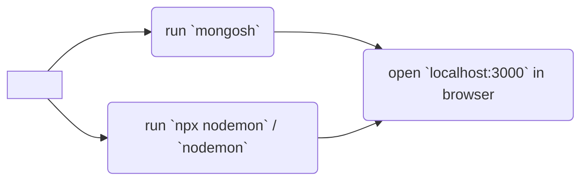

# YelpCamp
 ###### 
Capstone project in Colt Steele's [Web Developer Bootcamp](https://www.udemy.com/course/the-web-developer-bootcamp/) course on Udemy

 ###### 
- [Colt Steele's repository](https://github.com/Colt/YelpCamp)

## Description

Campground finder app

(**description to be edited**)

## Usage

If it is your **first time** running app on device, please:
 -  run `node seeds/index.js` to seed database (no need to do it ever again)
 - run `npm i` to install dependencies

